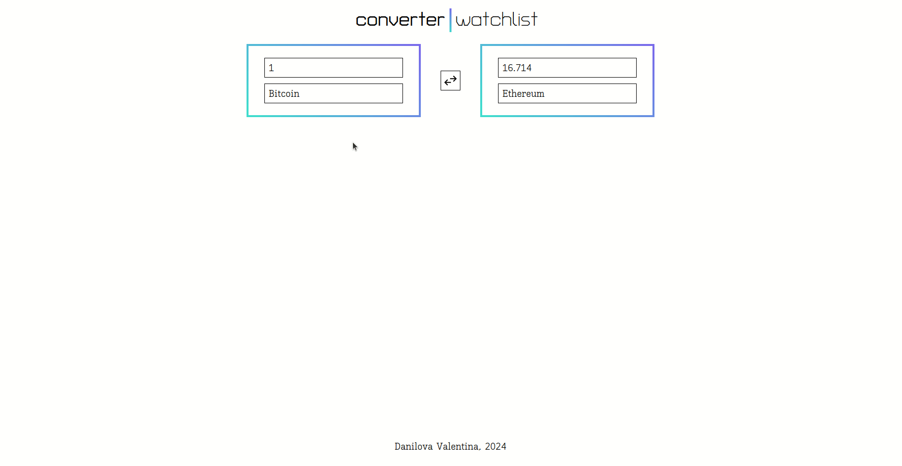

# Crypto Converter and Watchlist

This web application accumulates different information about crypto currencies using **[CryptoRank API](https://cryptorank.io/public-api).**

Here you can:

- convert crypto currencies,
- see extensive list of crypto currencies with prices and other information.

It is deployed to **Vercel** and is available at **https://crypto-converter-and-watchlist.vercel.app/**



## Features

### Converter

- [x] Retrieves information about crypto currencies via CryptoRank API;
- [x] Allows to choose crypto currencies and input the number you want to convert;
- [x] Allows to quickly switch left-hand and right-hand currencies.

### Watchlist

- [x] Retrieves information about crypto currencies via CryptoRank API;
- [x] Allows to see following information about crypto currencies in a table format: Name, Price (USD), Circulating supply, Market cap (USD), Category, and Historical price (USD) from 24 hours / 7 days / 30 days / 3 months / 6 months ago;
- [x] Pagination is implemented using `limit` and `offset` parameters from CryptoRank API.

### [calculateHistoricalPrice](/src/utils/index.tsx) function

- [x] Accepts current `price` and `percentChange` as its arguments and returns `historicalPrice`;
- [x] Price and Percent change from 24 hours / 7 days / 30 days / 3 months / 6 months ago are received from CryptoRank API;
- [x] Resulting Historical prices are displayed in separate columns in the Watchlist table.

### Tests

- [x] Integration & unit tests for React components;
- [x] Unit tests for utility functions (**including calculateHistoricalPrice**).

### Other notable features

- [x] **big.js** library is used to save precision in arithmetical operations;
- [x] Dropdown is searchable;
- [x] Skeleton component is used as a placeholder in table cells for a loading state;
- [x] For a nicer formatting of numbers, `formatNumberToSI` utility function is written.

## Tools & Technologies

- [Next.js](https://nextjs.org/)
- [React](https://react.dev/)
- [TypeScript](https://www.typescriptlang.org/)
- [styled-components](https://styled-components.com/)
- [SWR](https://swr.vercel.app/)
- [big.js](https://mikemcl.github.io/big.js/)
- [Jest](https://jestjs.io/) & [React Testing Library](https://testing-library.com/docs/react-testing-library/intro/)
- [Eslint](https://eslint.org/) & [Prettier](https://prettier.io/)
- [npm](https://docs.npmjs.com/about-npm) & [Node.js](https://nodejs.org/en)
- [Vercel](https://vercel.com/)

## If you want to run this application locally

1. Clone this repository to your computer.

   > If you are not familiar with cloning GitHub repositories, check [GitHub Docs](https://docs.github.com/en/repositories/creating-and-managing-repositories/cloning-a-repository).

   In the Terminal, go to the cloned project directory.

2. Sign up on [Cryptorank](https://cryptorank.io/) website and
   [generate](https://cryptorank.io/public-api/keys) API key.

3. Create `.env.local` file in the root folder of the project with following contents:
   `NEXT_PUBLIC_CRYPTORANK_API_KEY='YOUR_API_KEY'`,
   where `YOUR_API_KEY` is the API key you generated in the previous step.

4. Run following command to install all necessary dependencies:

   > If you don't have npm installed on your computer, follow [npm Docs](https://docs.npmjs.com/downloading-and-installing-node-js-and-npm) tutorial to install it.

   ```
   npm i && npm run dev
   ```

5. After that, your browser should automatically open a new tab and display the application. If it didn't happen, type

   ```
   http://localhost:3000/
   ```

   in the address bar of your browser.

   You are now ready to explore the application!

6. To run **tests**, first create `.env.test.local` file in the root folder of the project, and insert there the same contents as in your `.env.local` file.
7. After that, run
   ```
   npm run test
   ```
   to start tests and to see test coverage.
